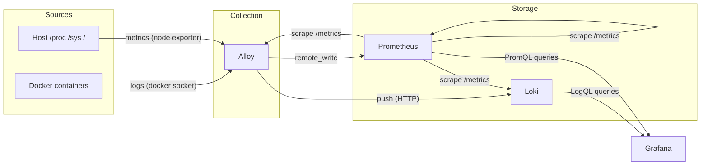

# Observability

Grafana + Loki + Prometheus + Alloy. All internal-only — no public routes. Access Grafana via `make tunnel` (SSH to VPS, localhost:3002).

## Data flow

Alloy is the single collector. It reads Docker logs via the socket and host metrics via `/proc`, `/sys`, `/`. Everything flows through it — no other container talks to Loki or Prometheus directly (except Grafana for queries).

## Stack

### Alloy (collector)

Config: `services/alloy/config.alloy`

**Logs:** Discovers all containers via Docker socket, tails their logs, pushes to Loki. Containers are labeled by name (strips the leading `/`).

**Metrics:** Runs a built-in `node_exporter` (CPU, memory, disk, network) using host-mounted `/proc`, `/sys`, `/`. Scrapes every 15s, remote-writes to Prometheus.

Host mounts give Alloy read access to the entire filesystem. Mitigated by `read_only`, `no-new-privileges`, and `cap_drop: ALL`. Docker socket mounted read-only for log tailing.

### Loki (log storage)

Config: `services/loki/loki.yaml`

- Storage: TSDB on local filesystem (`loki_data` volume)
- Retention: **7 days** (compactor prunes automatically every 10m)
- Auth: disabled (internal network only)
- Schema: v13, 24h index period

Query with LogQL in Grafana. Example: `{container="caddy"} |= "error"`.

### Prometheus (metrics storage)

Config: `services/prometheus/prometheus.yml`

- Storage: local TSDB (`prometheus_data` volume)
- Retention: **7 days**
- Scrape interval: 15s
- Remote write receiver enabled (Alloy pushes node metrics here)

Scrape targets:
| Job | Target | What |
|-----|--------|------|
| `prometheus` | `localhost:9090` | Self-metrics (query latency, storage, scrape health) |
| `alloy` | `alloy:12345` | Collector health, pipeline metrics |
| `loki` | `loki:3100` | Log pipeline health (ingestion rate, compactor, query latency) |
| `caddy` | `caddy:2019` | HTTP request rates, response codes, latency histograms |

Query with PromQL in Grafana. Example: `node_memory_MemAvailable_bytes / node_memory_MemTotal_bytes`.

### Grafana (dashboards)

Config: `services/grafana/provisioning/`

Datasources (provisioned as code, not editable in UI):
- **Prometheus** — default datasource, `http://prometheus:9090`
- **Loki** — `http://loki:3100`

Dashboard provider reads JSON files from `services/grafana/dashboards/` (mounted read-only). Provisioned dashboards: Platform Overview (host resources, containers, logs, Caddy traffic) and PostgreSQL (connections, performance, table health, database size).

Access: `localhost:3002` via SSH tunnel (`make tunnel`), or `localhost:3003` locally via `docker-compose.dev.yml`.

## Config files

| File | What it controls |
|------|-----------------|
| `services/alloy/config.alloy` | Log collection targets, metric exporters, push endpoints |
| `services/prometheus/prometheus.yml` | Scrape targets, intervals, retention |
| `services/loki/loki.yaml` | Storage backend, retention, compaction |
| `services/grafana/provisioning/datasources/datasources.yaml` | Grafana → Prometheus/Loki connection |
| `services/grafana/provisioning/dashboards/dashboards.yaml` | Dashboard file provider config |
| `services/grafana/dashboards/*.json` | Dashboard definitions (commit here to persist) |

## Adding a new scrape target

1. Add a `scrape_configs` entry in `services/prometheus/prometheus.yml`
2. The target must be reachable on the `internal` network by container name
3. Deploy — Prometheus picks up the new config on restart

## Adding app logs

Nothing to do. Alloy auto-discovers all containers on the Docker socket. Any new container on the VPS gets its logs shipped to Loki automatically. Filter in Grafana with `{container="your-container-name"}`.

## Adding app metrics

The app must expose a `/metrics` endpoint (Prometheus format). Then:

1. Add a scrape target in `prometheus.yml` pointing to `container-name:port`
2. Build a Grafana dashboard querying those metrics

## Retention and disk

Both Loki and Prometheus retain 7 days. At current scale (~10 containers, 15s scrape), expect:
- Prometheus: ~100-200MB
- Loki: ~200-500MB (depends on log volume)

The `disk-alert` systemd timer fires at 85% disk usage.

## What's not covered yet

- **Coupette app metrics** — structured logs, `/metrics` endpoint, RAG quality dashboard (Phase 8c)
- **Alerting rules** — Grafana alerting or Prometheus alertmanager (Phase 8c)
